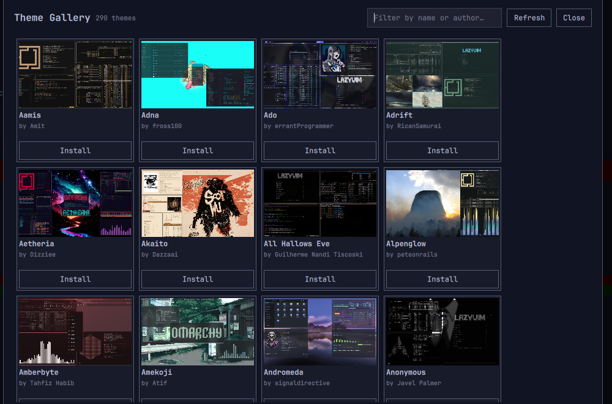

# Theme Gallery

An [Omarchy](https://omarchy.org/) shell plugin that browses community themes
from [omarchythemes.com](https://omarchythemes.com/) and installs one with a
click — no copy-pasting a git URL into `omarchy theme install`.



## What it does

- Scrapes the public theme listing at omarchythemes.com into a local catalog
  (name, author, preview, source repo).
- Shows it as a searchable grid inside the Omarchy shell (`panel` plugin —
  same family as the built-in Speed Test / Wi-Fi QR panels).
- Clicking **Install** runs `omarchy theme install <repo>` for community
  themes, or `omarchy theme set <name>` for the handful of official themes
  that are already bundled with Omarchy.
- Clicking **Refresh** re-scrapes the site and re-downloads thumbnails, so
  the catalog stays current without touching a terminal.

This is an unofficial, community tool. It isn't affiliated with Omarchy or
omarchythemes.com, and it doesn't ship any of their content — the catalog and
thumbnails are fetched fresh, on your machine, the first time you hit
Refresh.

## Install

```sh
omarchy plugin add <this-repo-url> --enable
```

Then open it from the Omarchy menu — **Style → Theme Gallery** — or run:

```sh
omarchy-shell shell summon lory.theme-gallery '{}'
```

On first run the gallery is empty; click **Refresh** to fetch the catalog
(a few minutes — it's a polite, rate-limited crawl of ~290 theme pages).
After that it's instant, reading from `cache/catalog.json` and cached
thumbnails in `cache/thumbs/`.

## How it's built

```
manifest.json           Omarchy plugin manifest (kind: panel)
Panel.qml                The gallery UI (Quickshell/QML)
scripts/
  scrape-catalog.sh       Rebuilds cache/catalog.json from omarchythemes.com
  cache-thumbnails.sh      Downloads each theme's preview image locally
  refresh.sh               Runs both of the above — what the Refresh button calls
cache/                    Generated locally, gitignored (not shipped)
```

`scrape-catalog.sh` identifies itself with a descriptive User-Agent and waits
between requests (default 0.4s) — see the script for `--delay`/`--limit`
flags if you want to tune that.

## Known limitations

- The catalog is a point-in-time snapshot; hit Refresh to update it.
- omarchythemes.com has no public API, so this scrapes its HTML. If the site
  changes its markup, `scrape-catalog.sh` may need updating.
- A handful of "official" Omarchy themes on the site link to the Omarchy
  manual instead of a repo; those show an **Apply** button (`omarchy theme
  set`) instead of **Install**.

## License

MIT — see [LICENSE](LICENSE).
